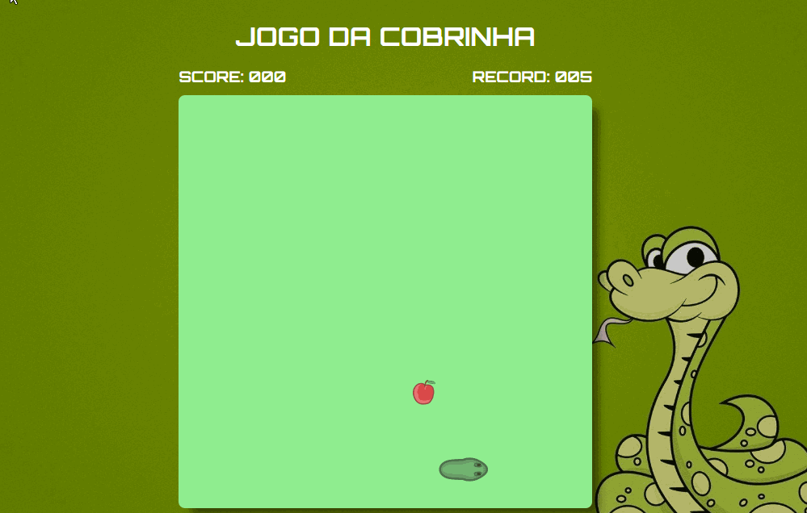
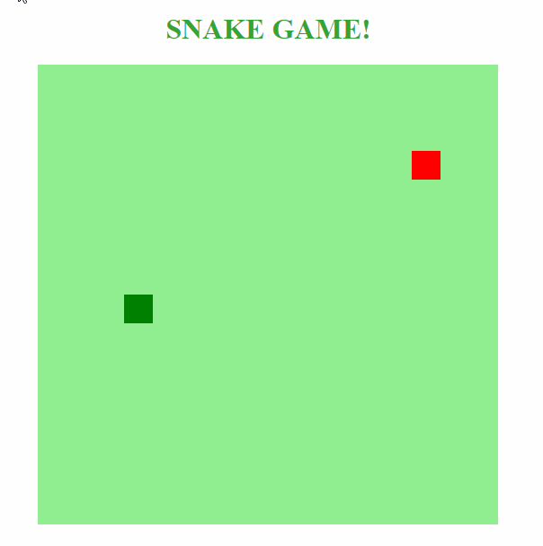

# Jogo da Cobrinha

## Sobre

Projeto desenvolvido durante bootcamp da [Digital Innovation One](https://digitalinnovation.one/)

Disponível em: [Jogo da Cobrinha](https://farleyguimaraes.github.io/jogo-da-cobrinha/)

### Projeto Base

Projeto disponibilizado pela instrutora do bootcamp

**Projeto base:**   [snake-the-game](https://github.com/SpruceGabriela/snake-the-game)

### Alterações no projeto base

- Adicionar efeito sonoro ao comer a fruta

- Adicionar efeito sonoro na tela de fim de jogo

- Adicionar pontuação

- Adicionar pontuação record

- Uso de sprites

  - Tutorial disponibilizado na plataforma da [DIO](https://digitalinnovation.one/). 

    Link do tutorial : [colocando-sprites-no-jogo-da-cobrinha](https://digitalinnovation.one/artigos/colocando-sprites-no-jogo-da-cobrinha)

- Tela de fim de jogo
  - Com base no projeto do [Leonardo Almeida][https://github.com/LeonardoVita/javascript-snake-game]
